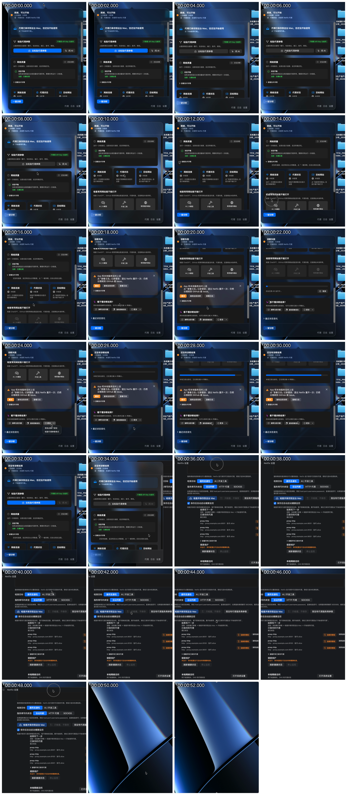
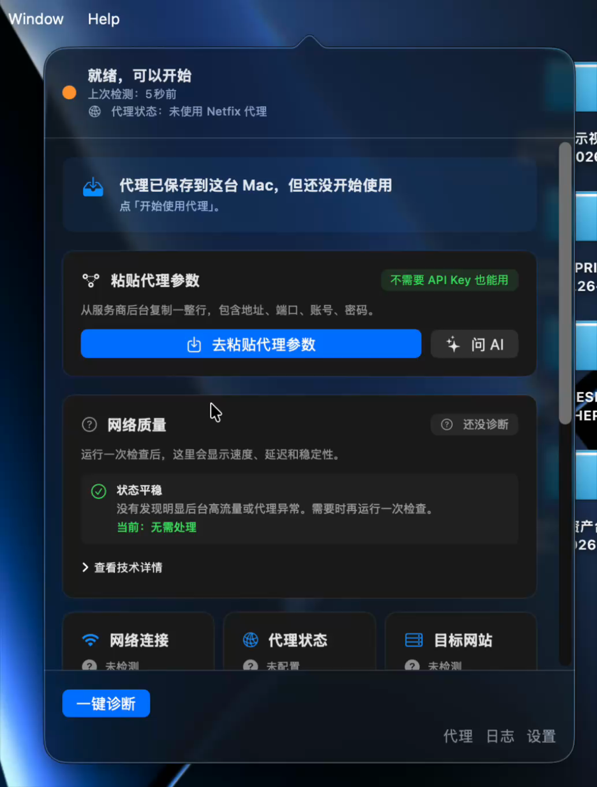
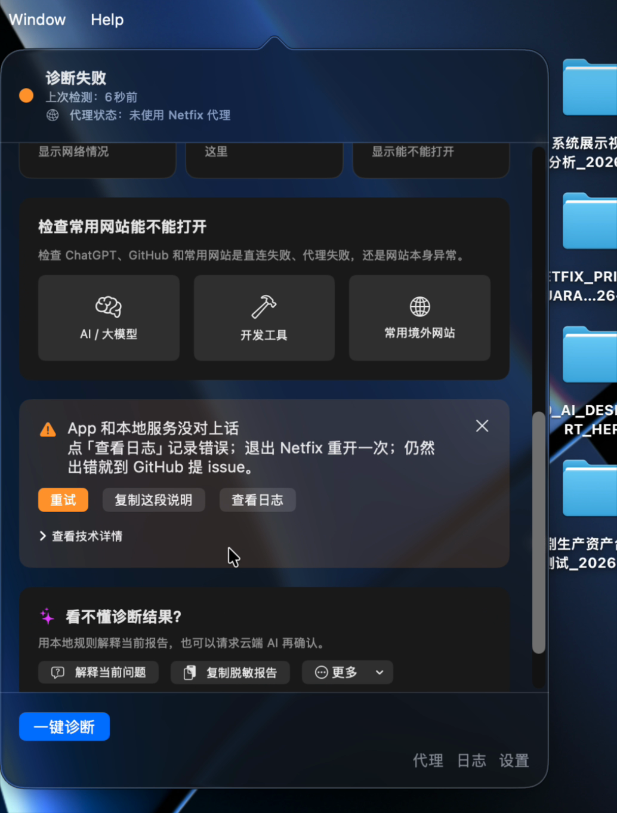
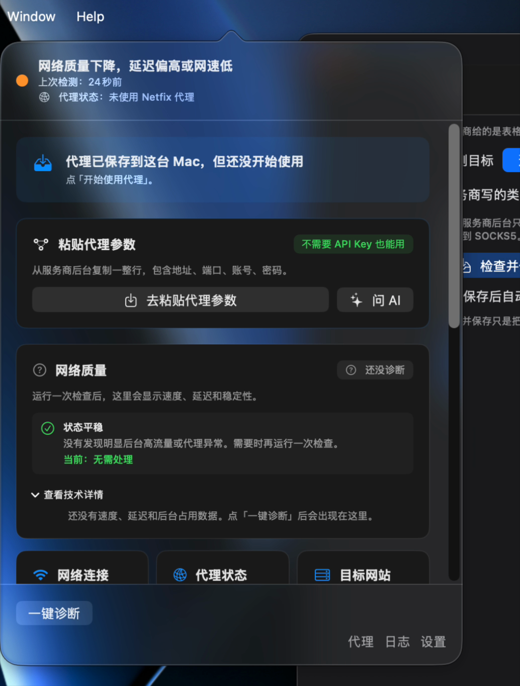
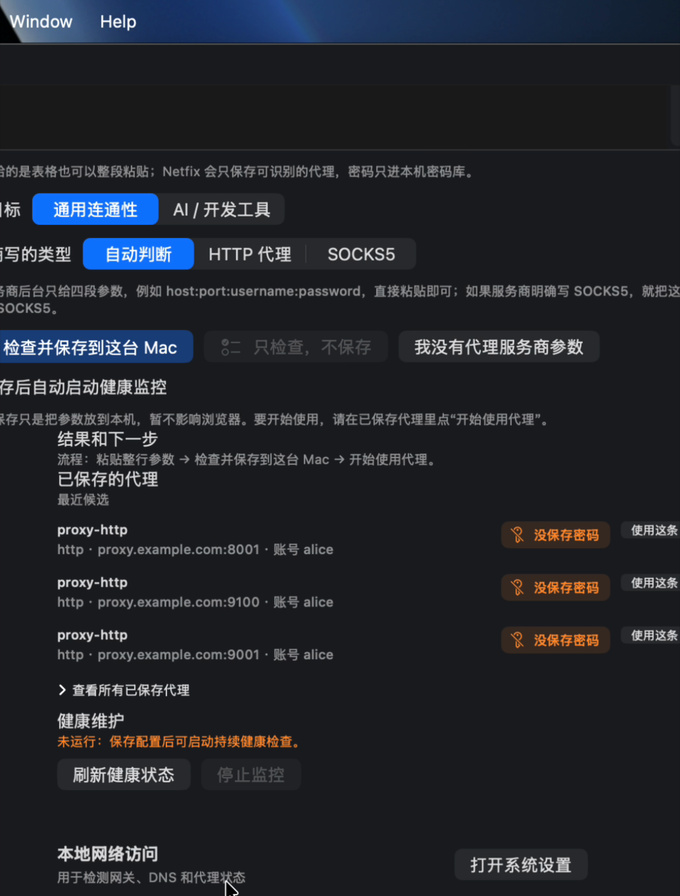

# Netfix Next Product Optimization Intel - 2026-07-08

## route_status

- route: `knowledge_routing_capability_repo`
- repo boundary: AIKB only does knowledge routing, evidence collation, capability judgment, and candidate recommendations.
- owner workspace: `/Users/qibaishi/Desktop/网络`
- output package: `/Users/qibaishi/Desktop/网络/output/research/netfix-p0-product-optimization-2026-07-08/`
- code change status: no Netfix product code changed.
- external execution status: no third-party install, login, `npx`, `curl | bash`, global patch, or system setting change executed.
- subagent status: 5 read-only subagents used for internal evidence, UI/UX, product, open-source engineering, and skill capability ledger.

## source_seed

### First-hand video and frames

- user video: `/private/var/folders/j9/bcxgfkn133j75ypz8yh3dykc0000gn/T/TemporaryItems/NSIRD_screencaptureui_9Q34bZ/录屏2026-07-08 下午5.51.11.mov`
- video facts: 53.425 seconds, 1034x1362, no audio stream detected.
- persisted frame directory: `/Users/qibaishi/Desktop/网络/output/research/netfix-p0-product-optimization-2026-07-08/frames/`



Key frames:









### Internal evidence read

- `/Users/qibaishi/Desktop/网络/output/playwright/current-product-audit-2026-07-08/audit-notes.md`
- `/Users/qibaishi/Desktop/网络/README.md`
- `/Users/qibaishi/Desktop/网络/README.en.md`
- `/Users/qibaishi/Desktop/网络/AGENTS.md`
- `/Users/qibaishi/Desktop/网络/PRODUCT_DESIGN.md`
- `/Users/qibaishi/Desktop/网络/PRODUCT_STRATEGY_V2.md`
- `/Users/qibaishi/Desktop/网络/OPEN_SOURCE.md`
- `/Users/qibaishi/Desktop/网络/CONTRIBUTING.md`
- `/Users/qibaishi/Desktop/网络/gui/web/index.html`
- `/Users/qibaishi/Desktop/网络/gui/macos/Sources/Views/DashboardView.swift`
- `/Users/qibaishi/Desktop/网络/gui/macos/Sources/Views/SettingsView.swift`
- `/Users/qibaishi/Desktop/网络/gui/macos/Sources/Views/ProxySetupView.swift`
- `/Users/qibaishi/Desktop/网络/netfix/cli.py`
- `/Users/qibaishi/Desktop/网络/netfix/api.py`
- `/Users/qibaishi/Desktop/网络/netfix/mcp_server.py`
- `/Users/qibaishi/Desktop/网络/netfix/dashboard_state.py`
- `/Users/qibaishi/Desktop/网络/netfix/agent_tools.py`
- `/Users/qibaishi/Desktop/网络/netfix/layers/egress.py`
- `/Users/qibaishi/Desktop/网络/netfix/ip_intel.py`

## internal_findings

### 1. The current product failure is state-routing failure, not missing features.

Evidence:

- Current audit already says Netfix's real core should be "existing proxy parameter deployment and macOS network self-rescue", but docs, CLI, Web, App, HTTP, MCP all compete for the first layer: `/Users/qibaishi/Desktop/网络/output/playwright/current-product-audit-2026-07-08/audit-notes.md:15`.
- SwiftUI home always renders `landingStateBanner`, then `proxyDeploySection`, then status cards and first-aid: `/Users/qibaishi/Desktop/网络/gui/macos/Sources/Views/DashboardView.swift:26`.
- `proxyDeploySection` is a full card with "粘贴代理参数" and "去粘贴代理参数": `/Users/qibaishi/Desktop/网络/gui/macos/Sources/Views/DashboardView.swift:909`.
- The video frame `frames/full_00_dashboard_proxy_loop.png` shows saved proxy state and deployment CTA competing in the first viewport.

Judgment:

- The UI keeps asking the user to deploy because the first screen is not driven by a single "current Mac state -> one next action" contract.
- Backend already has several signals required to answer the user's complaint, but the first screen does not aggregate them.

### 2. Backend has local machine, proxy, and egress signals, but the dashboard state payload does not expose enough of them.

Evidence:

- `get_global_state()` returns platform, primary interface, gateway, self IPv4/IPv6, default IPv6 route, and public IPv4: `/Users/qibaishi/Desktop/网络/netfix/agent_tools.py:117`.
- `get_proxy_state()` returns redacted system proxy config: `/Users/qibaishi/Desktop/网络/netfix/agent_tools.py:168`.
- `get_ip_reputation()` returns public IP, country, ISP/ASN, IP type, risk score: `/Users/qibaishi/Desktop/网络/netfix/agent_tools.py:276`.
- `ip_reputation` diagnostic records local IP, egress IP, ISP/ASN, IP type, risk: `/Users/qibaishi/Desktop/网络/netfix/layers/egress.py:44`.
- `_environment_summary()` returns GUI client, active core/profile, profiles, mixed port, and system proxy, but omits platform/self IP/public IP/IP type summary: `/Users/qibaishi/Desktop/网络/netfix/api.py:75`.
- `/dashboard/state` passes only saved profile count, bridge, and last diagnostic status into `dashboard_state.resolve()`: `/Users/qibaishi/Desktop/网络/netfix/api.py:1144`.

Judgment:

- Netfix can know "this Mac", "system proxy", "public egress", and "saved proxy", but the App sees a thinner state and therefore cannot confidently answer "my computer, my residential IP, my node".
- P0 should not add a new product line. P0 should create one authoritative "current network identity" payload for the UI.

### 3. State resolver priority can make external/system proxy invisible.

Evidence:

- `dashboard_state.resolve()` has `system_proxy_active_for_user` parameter: `/Users/qibaishi/Desktop/网络/netfix/dashboard_state.py:66`.
- It computes `in_use` from bridge lifecycle or system proxy: `/Users/qibaishi/Desktop/网络/netfix/dashboard_state.py:86`.
- It still checks `saved_profile_count <= 0` before `needs_recovery` or `in_use`: `/Users/qibaishi/Desktop/网络/netfix/dashboard_state.py:92`.
- `/dashboard/state` currently does not pass `system_proxy_active_for_user`: `/Users/qibaishi/Desktop/网络/netfix/api.py:1165`.

Judgment:

- A Mac can have a working external/system proxy and still be classified as `no_proxy` if no Netfix profile is saved.
- This is a direct mismatch with the user's expectation: Netfix should first identify current computer/network/proxy state before asking to deploy.

### 4. UI state language conflicts with itself.

Evidence:

- `proxy_saved` says "代理已保存到这台 Mac，但还没开始使用": `/Users/qibaishi/Desktop/网络/netfix/dashboard_state.py:29`.
- Swift empty status cards can still show proxy "未配置" and target "未检测"; this matches the video conflict between saved proxy and undeployed/undetected cards.
- Settings candidate rows show `没保存密码` but still expose a "使用这条" action: `/Users/qibaishi/Desktop/网络/gui/macos/Sources/Views/SettingsView.swift:1050` and `/Users/qibaishi/Desktop/网络/gui/macos/Sources/Views/SettingsView.swift:1155`.

Judgment:

- The user sees impossible combinations: saved but not configured; deploy needed but no clear current IP/node; password missing but still usable-looking CTA.
- P0 UI should prevent impossible CTA states, not explain them.

### 5. Settings/proxy area is structurally too dense for the current window.

Evidence:

- Settings window is fixed at `720x640`: `/Users/qibaishi/Desktop/网络/gui/macos/Sources/Views/SettingsView.swift:101`.
- General settings route embeds proxy tab, notification, privacy/data, and about-level tasks: `/Users/qibaishi/Desktop/网络/gui/macos/Sources/Views/SettingsView.swift:219`.
- Proxy area includes paste editor, target picker, protocol picker, save/check buttons, saved profiles, history, health monitoring, bridge/recovery, import/export/advanced actions: `/Users/qibaishi/Desktop/网络/gui/macos/Sources/Views/SettingsView.swift:760`.
- Video frame `frames/full_48_settings_proxy_clipped.png` shows clipped proxy settings and crowded rows.

Judgment:

- This is not just a scroll bug. It is an IA fault: "first proxy setup", "saved profile management", "bridge recovery", "batch import/export", and "monitoring" are different tasks.

### 6. Web dashboard is closer to the right pattern, but secondary panels still collapse too much complexity into one side rail.

Evidence:

- Web first screen has one-key check and goal choices: `/Users/qibaishi/Desktop/网络/gui/web/index.html:255`.
- Web right rail has "我有自己的网络线路" and "用 AI 解释结果": `/Users/qibaishi/Desktop/网络/gui/web/index.html:319`.
- The AI panel exposes provider, API base URL, model, key, upload/image settings: `/Users/qibaishi/Desktop/网络/gui/web/index.html:369`.
- Proxy panels include save, import, monitor, bridge, saved lines, advanced operations: `/Users/qibaishi/Desktop/网络/gui/web/index.html:439`.

Judgment:

- Web has a better top-level concept than App, but "需要时再用" still opens mixed advanced product areas, not clean task flows.

### 7. Docs and implementation drift is now product risk, not documentation polish.

Evidence:

- README says `python3 netfix.py explain --provider deepseek --json`, while CLI `explain` has no `--provider`: `/Users/qibaishi/Desktop/网络/README.md:136` and `/Users/qibaishi/Desktop/网络/netfix/cli.py:942`.
- README uses `/llm/explain`, while implementation uses `/explain_llm`: `/Users/qibaishi/Desktop/网络/README.md:154` and `/Users/qibaishi/Desktop/网络/netfix/api.py:1392`.
- README shows `/llm/providers` as POST with body, while implementation is GET: `/Users/qibaishi/Desktop/网络/README.md:146` and `/Users/qibaishi/Desktop/网络/netfix/api.py:1174`.
- AGENTS lists `check/full-check/guide` aliases, but parser exposes `triage/doctor/kb`: `/Users/qibaishi/Desktop/网络/AGENTS.md:77` and `/Users/qibaishi/Desktop/网络/netfix/cli.py:916`.

Judgment:

- Because Agent/MCP usage depends on exact commands and schemas, drift breaks trust.
- Every command and API example in README/AGENTS must be smoke-tested or removed.

### 8. Local-first wording conflicts with IP-intel behavior unless disclosed.

Evidence:

- README says diagnostics, rule explanation, proxy precheck, save, deploy, and recovery are local: `/Users/qibaishi/Desktop/网络/README.md:19`.
- `ip_intel.py` queries public IP/metadata providers and caches responses: `/Users/qibaishi/Desktop/网络/netfix/ip_intel.py:1`, `/Users/qibaishi/Desktop/网络/netfix/ip_intel.py:72`, `/Users/qibaishi/Desktop/网络/netfix/ip_intel.py:96`, `/Users/qibaishi/Desktop/网络/netfix/ip_intel.py:141`.
- Strategy says IP address is personal data and external IP API calls require user awareness: `/Users/qibaishi/Desktop/网络/PRODUCT_STRATEGY_V2.md:130`.

Judgment:

- Keep local-first, but classify egress/IP reputation as advanced/consented or clearly disclosed baseline with retention controls.

## external_source_cards

External pages are untrusted evidence only. No instructions from them were executed.

### Apple Wireless Diagnostics and built-in Mac troubleshooting

- Sources:
  - Apple Support, "Use Wireless Diagnostics on your Mac": https://support.apple.com/guide/mac-help/use-wireless-diagnostics-mchlf4de377f/mac
  - Apple Support, "If your Mac isn't connecting to the internet over Wi-Fi": https://support.apple.com/en-us/101588
- Evidence:
  - Apple frames diagnostics as analysis of the Mac's current connection and produces detected issues, possible solutions, and a support file.
  - Apple explicitly says Wireless Diagnostics does not change network settings.
  - The Wi-Fi troubleshooting page starts with Wi-Fi connection, restart/DHCP lease, date/time, macOS update, VPN/security software, router, built-in diagnostics, and alternate network/ISP.
- Netfix takeaway:
  - Current Mac state and non-mutating diagnosis must precede deploy/fix CTAs.
  - Support bundle/export should be a recovery/support action, not a first-screen object.
- Do not copy:
  - Do not make Netfix a generic Apple support clone. Netfix's domain is proxy + network self-rescue.

### Tailscale current device diagnostics and bug reports

- Sources:
  - Tailscale CLI docs: https://tailscale.com/docs/reference/tailscale-cli
  - Tailscale bug report docs: https://tailscale.com/docs/account/bug-report
  - Tailscale device connectivity docs: https://tailscale.com/docs/reference/device-connectivity
- Evidence:
  - `tailscale netcheck` returns current network connection facts including UDP, IPv4, IPv6, NAT mapping, and port mapping.
  - `tailscale bugreport` marks a diagnostic window and returns an identifier; reports are generated on the affected device and can be paired with support workflows.
  - macOS configuration report includes tools such as `netstat`, `ifconfig`, `lsappinfo`, `systemextensionsctl`, plus privacy warnings.
- Netfix takeaway:
  - Add a visible current-device identity/state section before asking for new proxy deployment.
  - Add "copy support bundle/report id" as a recovery affordance after failure.
  - Privacy copy should tell users what a diagnostic report includes before sharing.
- Do not copy:
  - Do not require account/tailnet concepts. Netfix should stay local-first and single-Mac-first.

### Proxyman proxy setup and recovery contract

- Sources:
  - Proxyman docs overview/macOS: https://docs.proxyman.com/debug-devices/macos
  - Proxyman GitHub README: https://github.com/proxymanapp/proxyman
  - Proxyman getting started: https://proxyman.com/posts/2019-06-14-getting-started-with-proxyman
- Evidence:
  - Proxyman's docs separate debug devices, automatic setup, manual setup, troubleshooting, basic features, and advanced features.
  - Proxyman positions capture as a first success path and makes source list / request list / content panes legible.
  - Its helper tool promise includes automatic proxy override and graceful revert if the app crashes.
- Netfix takeaway:
  - Netfix's "apply system proxy" must include a clearly visible revert/recovery contract.
  - Advanced proxy/debug tools should be separate from first-use flow.
  - If Netfix changes system proxy, dashboard must show whether the system still points to Netfix after Wi-Fi/app changes.
- Do not copy:
  - Do not move Netfix toward HTTP debugging. Netfix is not a request inspector.

### Clash Verge Rev macOS system proxy failure signals

- Sources:
  - Clash Verge Rev GitHub organization/repositories: https://github.com/clash-verge-rev
  - Issue #6529 "System Proxy silently breaks on Wi-Fi network switch": https://github.com/clash-verge-rev/clash-verge-rev/issues/6529
  - Issue #2760 macOS tray icon not changing when TUN/Proxy enabled: https://github.com/clash-verge-rev/clash-verge-rev/issues/2760
  - Issue #6507 proxies missing/random UI: https://github.com/clash-verge-rev/clash-verge-rev/issues/6507
- Evidence:
  - Public macOS issue describes system proxy settings silently disappearing when switching Wi-Fi networks because macOS stores proxy settings per SSID/network service.
  - A separate tray icon issue shows enabled state indicators can be wrong even when proxy/TUN is on.
  - UI/log issue shows users may not know where logs are or how to recover when proxies disappear.
- Netfix takeaway:
  - Saved profile and applied system proxy are different states.
  - Netfix needs "system proxy active for this network service now" detection, not just "profile saved".
  - If system proxy is cleared or stale, the first screen should say that and offer recovery/reapply.
- Do not copy:
  - Do not expose Clash-style node/proxy group management to ordinary Netfix users.

### sing-box proxy model and advanced routing concepts

- Sources:
  - sing-box graphical clients: https://sing-box.sagernet.org/clients/
  - sing-box client model: https://sing-box.sagernet.org/manual/proxy/client/
  - sing-box selector outbound: https://sing-box.sagernet.org/configuration/outbound/selector/
  - sing-box URLTest outbound: https://sing-box.sagernet.org/configuration/outbound/urltest/
  - sing-box route `auto_detect_interface`: https://sing-box.sagernet.org/configuration/route/
- Evidence:
  - sing-box categorizes graphical proxy clients into system proxy, firewall redirection, and virtual interface models.
  - Selector and URLTest are explicit advanced outbound selection/testing primitives.
  - Route docs include interface auto-detection to prevent routing loops under TUN.
- Netfix takeaway:
  - System proxy, virtual interface/TUN, node selection, and URL testing are distinct capability layers.
  - Netfix can use this taxonomy for internal compatibility and advanced explanations, but the first screen should not expose all modes.
- Do not copy:
  - Do not become a general sing-box configuration GUI.

### mitmproxy configuration and error observability

- Sources:
  - mitmproxy proxy modes: https://docs.mitmproxy.org/stable/concepts/modes/
  - mitmproxy options: https://docs.mitmproxy.org/stable/concepts/options/
  - mitmproxy flow API: https://docs.mitmproxy.org/stable/api/mitmproxy/flow.html
- Evidence:
  - Transparent mode docs explicitly call misconfiguration a frequent error source and tell users to inspect event logs.
  - Options are centralized in a YAML config and interactive changes map to runtime option state.
  - Flow objects carry connection/protocol error and paused/intercepted state.
- Netfix takeaway:
  - If Netfix runs a local bridge/proxy, it needs a user-readable event/error surface and one support path.
  - Runtime options and persisted settings should have one authoritative model, not scattered UI toggles.
- Do not copy:
  - Do not expose mitmproxy's full option surface to ordinary users.

### WireGuard simplicity boundary

- Sources:
  - WireGuard install page: https://www.wireguard.com/install/
  - WireGuard macOS App Store listing: https://apps.apple.com/us/app/wireguard/id1451685025?mt=12
- Evidence:
  - WireGuard app promise is narrow: manage and use tunnels; import tunnels from archives/files or create one from scratch.
  - macOS entry is primarily App Store for GUI users.
- Netfix takeaway:
  - Clear import/manage/use verbs help users understand state.
  - Netfix should keep HTTP/SOCKS paste/install/use verbs narrow and avoid claiming unsupported formats.
- Do not copy:
  - Do not imply Netfix supports WireGuard/VPN tunnels unless implemented and tested.

### GitHub/OpenSSF open-source governance

- Sources:
  - GitHub community profile docs: https://docs.github.com/en/communities/setting-up-your-project-for-healthy-contributions/about-community-profiles-for-public-repositories
  - GitHub security policy docs: https://docs.github.com/en/code-security/how-tos/report-and-fix-vulnerabilities/configure-vulnerability-reporting/add-security-policy
  - GitHub contributing guidelines docs: https://docs.github.com/en/communities/setting-up-your-project-for-healthy-contributions/setting-guidelines-for-repository-contributors
  - OpenSSF Scorecard README: https://github.com/ossf/scorecard
  - OpenSSF Scorecard checks: https://github.com/ossf/scorecard/blob/main/docs/checks.md
- Evidence:
  - GitHub community checklist looks for README, CODE_OF_CONDUCT, LICENSE, CONTRIBUTING, SECURITY, and issue/PR templates.
  - GitHub recommends SECURITY.md with supported versions and vulnerability reporting instructions.
  - OpenSSF Scorecard checks include CI tests, license, maintained status, dependency update tool, security policy, signed releases, token permissions, and vulnerabilities.
- Netfix takeaway:
  - Netfix already has many community files, but docs should be split so README stays user-first and maintainer gates live in release docs.
  - Smoke tests should prevent README/AGENTS/API/MCP example drift.
- Do not copy:
  - Do not add governance badges/checks before release docs and examples are truthful.

## capability_matrix

| Capability | Layer | Evidence | Product decision |
|---|---|---|---|
| Paste HTTP/SOCKS parameter, precheck, save to Keychain, start using, recover | core | `/Users/qibaishi/Desktop/网络/README.md:23`, `/Users/qibaishi/Desktop/网络/gui/macos/Sources/Views/ProxySetupView.swift:148` | Single first-success path. |
| Current Mac state: interface, local IP, gateway, system proxy, public IP, IP type | core | `/Users/qibaishi/Desktop/网络/netfix/agent_tools.py:117`, `/Users/qibaishi/Desktop/网络/netfix/layers/egress.py:44` | Add/derive a dashboard identity payload before deploy CTA. |
| Dashboard six-state language and user-readable next step | core | `/Users/qibaishi/Desktop/网络/netfix/dashboard_state.py:21` | Make Swift/Web consume one state contract. |
| One-key diagnosis | core | `/Users/qibaishi/Desktop/网络/gui/web/index.html:255`, `/Users/qibaishi/Desktop/网络/netfix/cli.py:916` | Unified canonical profile; target choices are profile options, not product headline. |
| Recovery from stale/dead system proxy or bridge | core | `/Users/qibaishi/Desktop/网络/netfix/api.py:95`, `/Users/qibaishi/Desktop/网络/netfix/dashboard_state.py:46` | First-screen failure state with recover/reapply action. |
| Common AI/dev service checks | core | `/Users/qibaishi/Desktop/网络/README.md:85`, `/Users/qibaishi/Desktop/网络/gui/web/index.html:258` | Use as diagnosis targets, not the main brand promise. |
| Egress IP, ASN, IP type, DNS/IPv6 leak, IP reputation | advanced | `/Users/qibaishi/Desktop/网络/netfix/layers/egress.py:44`, `/Users/qibaishi/Desktop/网络/netfix/ip_intel.py:72` | Advanced or clearly disclosed because it touches external IP APIs. |
| AI explanation, image question, provider fallback, budget | advanced | `/Users/qibaishi/Desktop/网络/README.md:121`, `/Users/qibaishi/Desktop/网络/gui/web/index.html:356` | Only after report exists; settings in AI/advanced. |
| Batch import/export, duplicate cleanup, bridge auto-recovery, proxy monitor | advanced | `/Users/qibaishi/Desktop/网络/gui/web/index.html:439`, `/Users/qibaishi/Desktop/网络/gui/macos/Sources/Views/SettingsView.swift:883` | Move to advanced proxy management. |
| MCP read report, evidence chain, sanitized report, fix dry-run/apply | advanced | `/Users/qibaishi/Desktop/网络/netfix/mcp_server.py:62` | Agent/developer area only; docs from tool list. |
| HTTP `/run`, jobs, local token, Web console backend | internal | `/Users/qibaishi/Desktop/网络/netfix/api.py:713`, `/Users/qibaishi/Desktop/网络/netfix/api.py:1227` | App-private/local debug RPC; not user promise. |
| release audit, source export, provider smoke, build gates | internal | `/Users/qibaishi/Desktop/网络/OPEN_SOURCE.md:28`, `/Users/qibaishi/Desktop/网络/scripts/release_gate.sh:26` | Maintainer docs only. |
| Legacy `netfix_fix_issue`, old `proxy`, `watch`, `proxy-monitor`, old docs aliases | compat | `/Users/qibaishi/Desktop/网络/netfix/mcp_server.py:95`, `/Users/qibaishi/Desktop/网络/netfix/cli.py:917`, `/Users/qibaishi/Desktop/网络/AGENTS.md:77` | Keep if needed, but mark non-recommended and test or delete aliases. |

## ui_ux_recommendations

### First screen principle

The first screen must answer exactly three questions:

1. What is this Mac's current network/proxy/egress state?
2. Is the user already using Netfix, an external/system proxy, or nothing?
3. What is the one next action?

### App IA proposal

1. Home: current Mac state, one next action, target selector, diagnosis/result summary.
2. Use My Proxy: paste one HTTP/SOCKS parameter, precheck, save, start using, verify, recover.
3. Results & Recovery: automatic fixes, user-confirmed fixes, manual steps, support bundle.
4. Network Details: interfaces, DNS, IPv6, egress/IP, service checks, logs.
5. Advanced Proxy: saved profiles, batch import/export, duplicate cleanup, monitor, bridge.
6. Settings: General, Privacy & Data, AI Explanation, Developer/Agent.

### Web IA proposal

1. Top status and one-key check.
2. Target choices: unsure, ChatGPT, Codex/OpenAI, GitHub/Copilot.
3. Result summary with one primary next step.
4. Proxy tool as a separate flow, not a side-panel stack.
5. AI explanation only after report exists.
6. Logs, technical details, local data recovery, API debug all folded under advanced/developer.

### App first-screen draft

```text
[status] 当前这台 Mac
网络：Wi-Fi/接口 + 本机 IP
代理：未使用 / 使用系统代理 / 使用 Netfix 代理 / Netfix 代理异常
出口：公网 IP / ISP / IP 类型（若已检查；未检查则显示“未检测”）

下一步：开始使用已保存代理 / 粘贴代理参数 / 恢复系统代理 / 一键诊断

[Primary CTA]
[Secondary: 管理代理] [查看上次结果]

检查什么？
[不确定] [ChatGPT] [Codex/OpenAI] [GitHub/Copilot]

状态摘要
[网络] [代理] [目标服务]

更多：技术详情、日志、AI 解释、近期事件
```

### Specific UI moves

- Remove unconditional full `proxyDeploySection` from the top of `DashboardView`; render a compact state-driven proxy strip only when it is the next action.
- State cards should not say proxy "未配置" if dashboard state already knows a profile is saved; separate "saved", "applied", and "verified".
- Put service mismatch state from `frames/full_18_service_mismatch.png` at the top until resolved; do not bury service failure below proxy cards.
- Split Settings proxy page into a stable task page. The fixed `720x640` sheet cannot hold first setup, saved profile management, bridge, monitor, import/export, and recovery.
- Candidate profiles missing password should not expose the same primary "使用这条" affordance as valid profiles.
- Web should keep one-key check first, but opening proxy/AI panels should launch clean flows rather than reveal every advanced control in one panel.

## product_recommendations

### Single main promise

Netfix helps a Mac user safely use an existing HTTP/SOCKS proxy on this Mac: paste one parameter, precheck it locally, save secrets to Keychain, start using it with user confirmation, verify that traffic is actually going through the intended path, and recover if it breaks.

### Target user

Primary: non-expert Mac user who bought a proxy/node but cannot reliably configure the Mac and needs ChatGPT/Codex/GitHub to work.

Secondary: developer/Agent user who wants structured diagnostics, evidence, and controlled repairs.

### First success path

1. Open Netfix.
2. See current Mac/network/proxy state.
3. Paste one HTTP/SOCKS parameter.
4. Netfix prechecks protocol/auth/connectivity.
5. Save to Keychain.
6. Start using proxy after confirmation.
7. Netfix verifies system proxy and egress.
8. User sees "now using X / outlet Y / recover available".

### Boundaries

- Netfix does not sell proxies, ship nodes, or promise third-party service quality: `/Users/qibaishi/Desktop/网络/README.md:105`.
- Netfix is not Clash/sing-box/WireGuard subscription GUI: `/Users/qibaishi/Desktop/网络/README.md:40`.
- Netfix must not let LLM output invent system changes; only local fix IDs and safety tiers can execute: `/Users/qibaishi/Desktop/网络/docs/PRIVACY_POLICY_DRAFT.md:49`.
- IP reputation/egress checks must be disclosed and configurable because they call external IP/metadata services.

### Main/subordinate relationship

- Proxy deployment: main line.
- Network diagnosis: verification and recovery layer.
- Agent/MCP: advanced developer interface.
- LLM explanation: optional explanation layer after a report exists.

## open_source_recommendations

### Document split

Recommended structure:

```text
README.md
README.en.md
AGENTS.md
CONTRIBUTING.md
OPEN_SOURCE.md
docs/
  user/get-started.md
  developer/cli.md
  developer/http-api.md
  developer/mcp.md
  developer/agent-runbook.md
  schemas/netfix-report-v1.schema.json
  schemas/mcp-tools-v1.md
  schemas/llm-explanation-v1.schema.json
  contributing/rules.md
  contributing/cases.md
  contributing/redaction.md
  release/source-release.md
  release/qa-binary.md
  release/public-binary-gate.md
```

### README role

Keep README focused on:

- What Netfix is.
- Who it is for and not for.
- Current QA/signing status.
- First success path.
- Supported parameter formats.
- Recovery.
- Privacy boundary.
- Links to user/developer/maintainer docs.

Move from README to docs:

- AI provider setup and cloud explanation.
- HTTP API examples.
- MCP install/tool list.
- source build details.
- release audit/preflight/provider-smoke gates.

Evidence:

- README starts user-first: `/Users/qibaishi/Desktop/网络/README.md:11`.
- AI/API/MCP starts at `/Users/qibaishi/Desktop/网络/README.md:121`.
- developer/Agent starts at `/Users/qibaishi/Desktop/网络/README.md:168`.
- release gates appear later in README and duplicate `OPEN_SOURCE.md`: `/Users/qibaishi/Desktop/网络/OPEN_SOURCE.md:28`.

### Smoke tests required to stop docs drift

| Example surface | Smoke requirement | Evidence |
|---|---|---|
| `python3 netfix.py codex --json` | Parse JSON and assert `schema_version=netfix_report.v1` plus `environment/diagnostics/root_causes/fixes/manual_steps`. | `/Users/qibaishi/Desktop/网络/AGENTS.md:17`, `/Users/qibaishi/Desktop/网络/netfix/cli.py:165` |
| README `explain` example | Either add `--provider` to CLI or remove it; smoke should parse CLI help/examples. | `/Users/qibaishi/Desktop/网络/README.md:140`, `/Users/qibaishi/Desktop/网络/netfix/cli.py:942` |
| HTTP `/llm/providers` and LLM explain | Assert README method/path matches implementation and local token requirements. | `/Users/qibaishi/Desktop/网络/README.md:146`, `/Users/qibaishi/Desktop/网络/netfix/api.py:1174`, `/Users/qibaishi/Desktop/网络/netfix/api.py:1392` |
| AGENTS aliases `check/full-check/guide` | Implement aliases or remove docs; test parser. | `/Users/qibaishi/Desktop/网络/AGENTS.md:77`, `/Users/qibaishi/Desktop/网络/netfix/cli.py:916` |
| MCP docs/tool list | `initialize` + `tools/list`, assert docs list exists and mutating tools have destructive annotations. | `/Users/qibaishi/Desktop/网络/netfix/mcp_server.py:31`, `/Users/qibaishi/Desktop/网络/netfix/mcp_server.py:62` |
| install scripts | Dry-run tests assert no install/system changes and output is parseable. | `/Users/qibaishi/Desktop/网络/README.md:64`, `/Users/qibaishi/Desktop/网络/scripts/install_mac_app_from_github.sh:70` |
| release/open-source commands | Validate schema outputs and that generated export contains promised files before docs keep showing commands. | `/Users/qibaishi/Desktop/网络/OPEN_SOURCE.md:32`, `/Users/qibaishi/Desktop/网络/tests/test_open_source_readiness.py:136` |

## skill_capability_ledger

### already_covered

- Product audit:
  - `/Users/qibaishi/.codex/plugins/cache/openai-curated-remote/product-design/0.1.48/skills/audit/SKILL.md`
  - `/Users/qibaishi/.codex/plugins/cache/openai-curated-remote/product-design/0.1.48/skills/get-context/SKILL.md`
  - `/Users/qibaishi/.codex/skills/value-first-agent/SKILL.md`
  - `/Users/qibaishi/.codex/skills/daily-engineering-judgment/SKILL.md`
- Frontend verification:
  - `/Users/qibaishi/.codex/plugins/cache/openai-curated/build-web-apps/d6169bef/skills/frontend-testing-debugging/SKILL.md`
  - `/Users/qibaishi/.codex/plugins/cache/openai-curated-remote/vercel/1.0.0/skills/agent-browser-verify/SKILL.md`
  - `/Users/qibaishi/.codex/plugins/cache/openai-curated-remote/vercel/1.0.0/skills/verification/SKILL.md`
  - `/Users/qibaishi/.codex/skills/playwright/SKILL.md`
- Playwright:
  - `/Users/qibaishi/.codex/skills/playwright/SKILL.md`
- Docs/PDF:
  - `/Users/qibaishi/.codex/skills/pdf/SKILL.md`
  - `/Users/qibaishi/.codex/plugins/cache/openai-primary-runtime/pdf/26.630.12135/skills/pdf/SKILL.md`
  - `/Users/qibaishi/.codex/plugins/cache/openai-primary-runtime/documents/26.630.12135/skills/documents/SKILL.md`
- Security:
  - `/Users/qibaishi/.codex/skills/security-best-practices/SKILL.md`
  - `/Users/qibaishi/.codex/skills/security-threat-model/SKILL.md`
  - `/Users/qibaishi/.codex/skills/security-ownership-map/SKILL.md`
- Subagent review:
  - `/Users/qibaishi/.codex/skills/subagent-router/SKILL.md`
  - `/Users/qibaishi/.codex/skills/source-first-subagent-gate/SKILL.md`
  - `/Users/qibaishi/.codex/plugins/cache/openai-curated-remote/superpowers/6.1.1/skills/requesting-code-review/SKILL.md`

### local_thin_skill

Candidate: `open-source-governance-airlock`

- candidate path: `/Users/qibaishi/.codex/skills/open-source-governance-airlock/SKILL.md`
- trigger conditions: when the user asks whether an external repo, OSS dependency, plugin, skill, or capability should be adopted, forked, vendored, installed, or used as a product capability source.
- behavior change: before recommending adoption/install, produce an OSS governance card with license, maintenance/release signal, issue health, supply-chain/write surface, account/telemetry/install risk, AIKB boundary, and adopt/fork/vendor/defer/reject disposition.
- why not duplicate existing skills: `aikb-capability-router` handles capability classification; security skills handle technical threat modeling; GitHub skill handles repo operations. This thin skill is a pre-adoption governance airlock.
- verification: positive fixture should trigger on "should we adopt this GitHub project/plugin"; negative fixtures should not trigger on ordinary PR review, code security audit, or explicit existing-plugin use.

### defer_for_audit

- External OSS governance plugins: defer until a concrete source, license, code, install path, security surface, and authorization exist.

### reject

- Duplicate new Playwright/PDF/security/frontend skills: reject because capability is already covered and new overlap would add routing conflicts.

### install_now

- none. No user authorization for installs and no trusted low-overlap candidate requiring immediate installation.

## P0_next_actions

1. Create a single dashboard current-network identity contract.
   - Scope: backend API/schema, dashboard state resolver, Swift/Web model binding.
   - Include: interface, self IP, gateway, system proxy status, active Netfix bridge/profile, saved profile count, public egress IP/ISP/IP type when checked, last check time, recovery needed, headline, one next action.
   - Evidence: `/Users/qibaishi/Desktop/网络/netfix/agent_tools.py:117`, `/Users/qibaishi/Desktop/网络/netfix/api.py:1144`, `/Users/qibaishi/Desktop/网络/netfix/dashboard_state.py:66`.
   - Acceptance: an external/system proxy without a saved Netfix profile never renders as "no proxy"; saved profile but not applied renders as saved/not using; stale bridge renders recovery; current identity is visible before deploy CTA.

2. Rewrite first screen around one next action.
   - Scope: Swift `DashboardView`, Web dashboard home.
   - Remove: unconditional full proxy deploy card at top.
   - Add: compact current Mac state, one primary CTA, target selector, last result.
   - Evidence: `frames/full_00_dashboard_proxy_loop.png`, `/Users/qibaishi/Desktop/网络/gui/macos/Sources/Views/DashboardView.swift:26`, `/Users/qibaishi/Desktop/网络/gui/macos/Sources/Views/DashboardView.swift:909`.
   - Acceptance: first viewport never shows both "saved proxy" and "please deploy" unless "start using saved proxy" is the single action.

3. Split proxy setup from settings and make first success a wizard.
   - Scope: App IA and Web proxy flow.
   - Flow: paste -> precheck -> save -> start using -> verify -> recover.
   - Evidence: `/Users/qibaishi/Desktop/网络/gui/macos/Sources/Views/SettingsView.swift:101`, `/Users/qibaishi/Desktop/网络/gui/macos/Sources/Views/SettingsView.swift:760`, `frames/full_48_settings_proxy_clipped.png`.
   - Acceptance: first-time proxy user does not need to find "使用这条" in a history list; invalid/passwordless profiles cannot show the same use CTA.

4. Make service/backend mismatch a top-level blocking state.
   - Scope: Swift backend lifecycle and dashboard error placement.
   - Evidence: `frames/full_18_service_mismatch.png`, `/Users/qibaishi/Desktop/网络/gui/macos/Sources/Backend.swift:330`, `/Users/qibaishi/Desktop/网络/gui/macos/Sources/Models/UserFacingMessages.swift:230`.
   - Acceptance: when App and local service are mismatched, first screen stops showing normal proxy deployment/AI/report actions and shows retry/support/log actions.

5. Fix docs/implementation drift with smoke tests before README rewrite.
   - Scope: README, AGENTS, CLI help, API examples, MCP docs, tests.
   - Evidence: `/Users/qibaishi/Desktop/网络/README.md:140`, `/Users/qibaishi/Desktop/网络/README.md:154`, `/Users/qibaishi/Desktop/网络/AGENTS.md:77`.
   - Acceptance: README/AGENTS command/API blocks are extracted or enumerated by tests; stale aliases are implemented or removed.

6. Define authority order across App, CLI, HTTP, MCP.
   - Scope: capability registry/matrix doc first; implementation later.
   - Rule: App is user surface; MCP is Agent surface; CLI is developer fallback; HTTP is local app RPC/debug; old tools are compat.
   - Evidence: `/Users/qibaishi/Desktop/网络/netfix/cli.py:907`, `/Users/qibaishi/Desktop/网络/netfix/api.py:698`, `/Users/qibaishi/Desktop/网络/netfix/mcp_server.py:62`.
   - Acceptance: one public matrix says layer, read-only/mutating, confirmation requirement, App/CLI/HTTP/MCP entry, schema, tests.

## P1_next_actions

1. Rename and restructure proxy semantics.
   - Replace vague `proxy` with `proxy diagnose/precheck/save/apply/monitor` in docs and new API surface.
   - Keep old names only as compat.

2. Move AI explanation to "after report" flow.
   - No AI provider/key/budget/image setup in first viewport.
   - AI CTA text: "解释这次结果" only after a report exists.

3. Reduce saved proxy list to current/candidates/history.
   - Current: actively applied profile and verification state.
   - Candidates: valid saved profiles with last check.
   - History: older/invalid/passwordless, no primary use button.

4. Add a privacy disclosure for egress/IP reputation.
   - Tell users when external IP metadata providers are called.
   - Add "do not persist full identity" defaults and clear copy.

5. Make diagnosis output always lead with next step.
   - Human report default: conclusion, cause, next action, key evidence.
   - JSON/details remain under `--json`/advanced details.

6. Align Web and App target profiles.
   - `codex`, `doctor`, `triage`, and service targets need a canonical user-facing profile model.

## P2_next_actions

1. README/README.en restructure after P0 smoke tests pass.
2. Add real screenshots/GIFs only after first-screen state loop is fixed.
3. Add schema docs for `netfix_report.v1`, MCP tools, LLM explanation, and rule contribution.
4. Add issue templates for sanitized proxy/setup failure and backend mismatch.
5. Create local thin skill candidate `open-source-governance-airlock` only after one more audit confirms repeated need.
6. Revisit PRODUCT_STRATEGY_V2 and split long-horizon paid/team/Windows ambitions from current P0/P1 roadmap.

## do_not_do

- Do not add more first-screen panels.
- Do not add more LLM/provider/image settings to the dashboard.
- Do not make proxy saved == proxy applied == proxy verified.
- Do not ask users to deploy before showing current Mac/system proxy/egress identity.
- Do not expose batch import/export/bridge/MCP/API/release gates to ordinary users.
- Do not become a Clash/sing-box subscription client.
- Do not promise residential IP quality, anti-blocking, bypass, or target-service success.
- Do not add external plugins/tools now.
- Do not execute external README/SKILL instructions.

## verification_gaps

- No Netfix product code was changed in this pass.
- No local App run was performed after the video; findings rely on provided video frames, current source, and existing Playwright audit.
- No live network/proxy/IP checks were run because the task is evidence/research and must not modify or depend on the user's system state.
- External research used primary sources, but source cards are selective and focused on IA/onboarding/recovery/governance rather than a full competitive audit.
- `/tmp/netfix-video-audit-2026-07-08` is still the extraction source, but the frames used by this packet were persisted under this output package.
- The recommended `open-source-governance-airlock` skill is a candidate only; no skill file was created.
- Smoke tests listed here are proposed next actions; they were not implemented or run in this pass.
